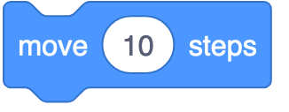
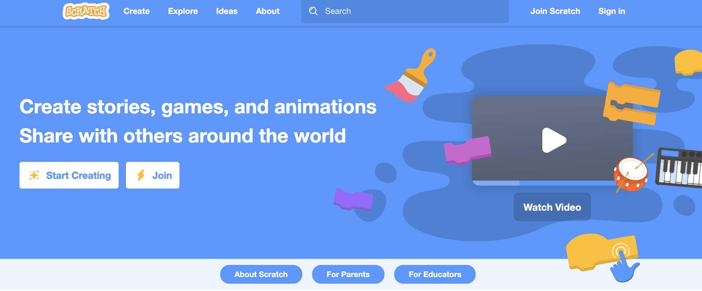
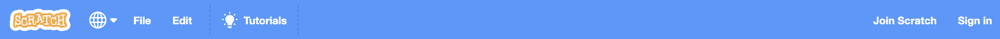
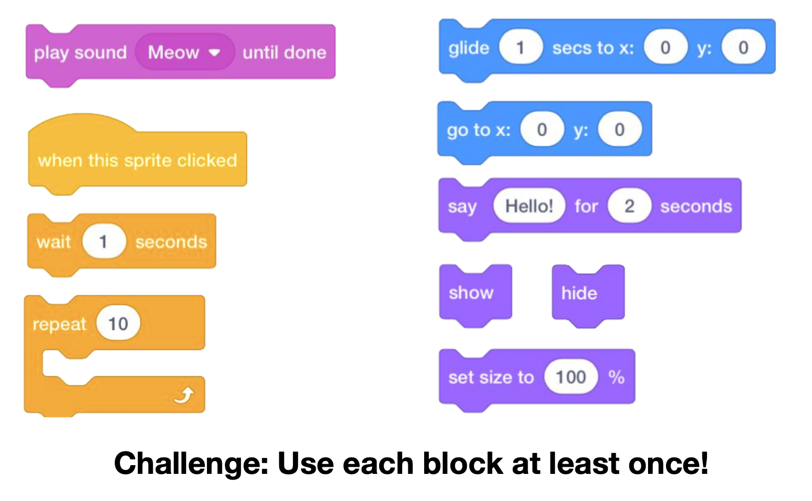

footer: [Coding & STEAM 2019 Program](http://cs4s.github.io/steam-2019)

# Coding, Computational Thinking and Scratch

## Coding & STEAM 2019

### Mr Daniel Hickmott & Dr Elena Prieto-Rodriguez

#### Week 1: An Introduction to Scratch

##### 1st August 2018

---

# What is Coding?

- Computers only understand precise and step-by-step instructions - no ambiguity
- *Coding* is writing instructions for a computer in a language that it can understand (a *programming language*)
- Scratch is a *visual programming language*

---

# Coding for All

- There are predictions that, in the future, everyone will need to know how to read and write *Code* (BigThink, 2019)
- Increased automation, more widespread access to computers and new/changing industries could result in a higher demand for *Coders*
- *Computer Science* usually has the most demand for graduates when looking at STEM workforce projections

---

# Why Teach Coding to Everyone?

- Guzdial (2015) identifies four main reasons for teaching coding to everyone:
	- *Jobs*
	- **Broadening Participation**
	- **Computational Literacy** (includes **Computational Thinking**)
	- **Understanding the World**

---

# Computational Thinking

- Usually, the purpose of teaching *Coding* is not just for the sake of teaching students to *Code* but to develop learners' *Computational Thinking* as well (our focus)
- Some argue that Coding can help learners improve their general problem-solving abilities and logical thinking as well :grimacing:
- Note: some educators/researchers use the term *Computing*, a grouping of *Coding*, *Computational Thinking* and general *ICT*

---

# Defining Computational Thinking

- NESA use the popular definition from Dr Jeannette Wing (2014):

> *Computational thinking is the thought processes involved in formulating a problem and expressing its solution(s) in such a way that a computer – human or machine – can effectively carry out.*

- Wing has described what she sees as different characteristics of *Computational Thinking* (for example, *decomposition* and *algorithms*)

---

# Defining Computational Thinking

-  Since Wing's first definition (around 2006) there have been disagreements about what *Computational Thinking* means
- Different groups have proposed different definitions but there is usually overlap between them
- For this program, we use the framework developed by Brennan and Resnick (2012) to define *Computational Thinking*

---

# Computational Thinking Framework

- [Links > ScratchEd: Defining Computational Thinking](http://scratched.gse.harvard.edu/ct/defining.html)
- Brennan and Resnick define *Computational Thinking* as made up of three dimensions: *Computational Concepts*, *Computational Practices* and *Computational Perspectives*
- Developed through research on students using *Scratch*
- We will relate outcomes from Science and Technology K-6 syllabus to this framework where possible

---

# Science and Technology K-6 Syllabus

*Digital Technologies* strand outcomes (p. 91):

- *ST3-2DP-T:* plans and uses materials, tools and equipment to develop solutions for a need or opportunity
- **ST3-3DP-T: defines problems, and designs, modifies and follows algorithms to develop solutions**
- *ST3-11DI-T:* explains how digital systems represent data, connect together to form networks and transmit data

---

# Descriptors and Computational Thinking Framework

From *Designing Digital Solutions* heading (p. 93):

- design, modify and follow algorithms [*sequence* of steps] involving branching [*conditionals*] and iteration [*loops*]
- define problems, and plan and implement digital solutions,using an appropriate visual programming language [*Scratch*] involving branching [*conditionals*] and iteration [*loops*], and requiring user input 

---

# Teaching Coding in K-6

- Research in this area mainly at a tertiary level (Guzdial, 2015)
- *Pedagogical content knowledge* specific to *Coding* is relatively new
- Difficult to find time and resources to teach *Coding*
- Suggestions to integrate *Coding* into other subjects

---

# Coding Across Key Learning Areas

- How does the integration of *Coding* work in practice and do students benefit?
- Our research and programs investigates this
- It's 'early days' for compulsory teaching of *Coding*
- The main aim of this program is give you some ideas for ways of teaching *Coding* alongside other subjects that work in your context

---

# Coding with Scratch

- *Scratch* is just one tool, of many, that can be used for *Coding*
- The concepts you learn about in program will transfer to other tools and devices (for example, *Spheros* and *Microbits*)
- We really like *Scratch* and encourage you to use it
- *Scratch* has a large community and is very open (we hope to discuss concerns about content and privacy throughout program)

---

## Scratch

- Created and maintained by MIT Media Lab
- Designed to have: *low floor*, *wide walls* and *high ceiling*
- Free to use
- Moderated community

---

# Offline vs Online Version

- Online version of Scratch (our focus) has three main advantages:
	- the Community
	- Teacher Accounts
	- You don't need to install anything on school PCs
- Offline version may be better suited to schools with unreliable or slow internet connections

---

# Website

- [scratch.mit.edu](https://scratch.mit.edu)

---

# Scratch Homepage

- **Start Creating** / **Create**
- **Explore**
- **Ideas**
- **Join Scratch** / **Join**

---

# Type of Accounts

- **Normal Account**
- **Student Accounts**
- **Teacher Accounts**

---

# Palettes and Panes

- **Block Palette**
	- *Code* tab
	- Blocks are grouped by function
	- Colours indicate the type of block (for example: all *motion* blocks are blue) 

---

# Palettes and Panes

- **Sprites Pane**
	- Different ways to add *Sprites*
	- Blue highlight = *Sprite* is selected 
- **Scripts Area**
	- This is where blocks are placed to create *scripts*
	- Each *Sprite* has a different *Scripts Area*

---

# Palettes and Panes

- **Costume Pane** (or *Costume tab*)
	-  Each *Sprite* can have 1 or more *Costumes*
- **Sounds Pane**
	- A list of audio clips for the *Sprite*
	- Could be sound effects (for example: a dog barking) or background music

---

# Stage

- Also referred to as the *Canvas*
- Has two buttons:
	- *Green Flag*
	- *Stop Sign*
- Has its own *Script* area 
	- Blocks available to *Stage* differ to those available for *Sprites*

---

# Toolbar

- There is a *Toolbar* at the top of the *Scratch* project editor

- A couple of examples that will be useful for this workshop:
	- *File > Load from your computer*
	- *Edit > Restore*

---

# Scratch Summary

- In this presentation I have:
	- Introduced you to *Scratch*
	- Compared the Offline and Online versions
	- Explained the main parts of *Scratch*
	- Briefly described the 3 types of *Scratch* accounts
- **Any questions before you try out Scratch?**

---

# Getting Started with Scratch

- Let's all try out Scratch with a quick activity
- Learn about different features of Scratch
- First, log on with your Scratch account
- On session website: 
	- *Activities > Getting Started with Scratch*

---

# Creative Computing Curriculum Guide

- [scratched.gse.harvard.edu/guide/](https://scratched.gse.harvard.edu/guide/)
- A guide for introducing *Coding* (not specific to K-6)
- Activities designed to encourage students' creative expression
- Focused on *Scratch* but could be adapted for other tools
- From Week 3 on, we will focus on activities from the Guide

--- 

# 10 Blocks & Concepts

- On Week 1 session page: *Activities > 10 Blocks*
- Think about how these concepts are applied:
	- *Sequences* (following instructions step by step)
	- *Loops* (following instructions over and over)
	- *Events* (when something happens, do something else)

---

---

# Computational Concepts

- Did you use *Sequences*?
- Did you also use *Loops*?
- What about *Events*?
- Did you learn about any other *Computational Concepts*?

---

# Sharing a Project

- When you create a project, only you can see it - until you share it
- The simplest way to share a project is with the *Share* button in the editor
- Once shared, a project is **publicly visible** - to everyone
- You will learn more about sharing projects, *Teacher Accounts* and *Studios* next week

---

# 10 Blocks Examples

- Let's look at some of your 10 Blocks projects before we wrap up

---

# References

- BigThink (2019). "Will coding become a basic life skill? Yes and no, say experts." Available from: [https://bigthink.com/technology-innovation/coding-life-skill](https://bigthink.com/technology-innovation/coding-life-skill)

- Brennan, K. and M. Resnick (2012). "New frameworks for studying and assessing the development of computational thinking." Proceedings of the 2012 annual meeting of the American Educational Research Association, Vancouver, Canada.
	
---

# References

- Guzdial, M. (2015). "Learner-Centered Design of Computing Education: Research on Computing for Everyone." Synthesis Lectures on Human-Centered Informatics 8(6): 1-165.

- Wing, J. M. (2014). "Computational thinking benefits society." 40th Anniversary Blog of Social Issues in Computing 2014. Available from [http://socialissues.cs.toronto.edu/index.html%3Fp=279.html](http://socialissues.cs.toronto.edu/index.html%3Fp=279.html)
	