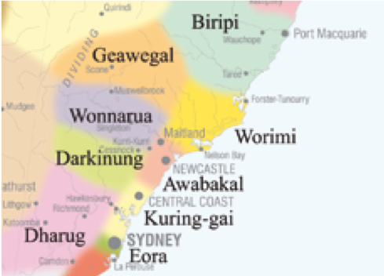

footer: [Coding & STEAM 2019 Program](http://cs4s.github.io/steam-2019)

# An Introduction to the Program

## Coding & STEAM 2019

### Mr Daniel Hickmott & Dr Elena Prieto-Rodriguez

#### Week 1: An Introduction to Scratch

##### 1st August 2018

---

# Welcome!

- We acknowledge and respect the Pambalong clan of the Awabakal people, traditional custodians of this land.

---

# Logistics & Admin

- Logging on
- Bathrooms
- Fire Alarm
- Security
	- 4921 5888

---

# Introductions

- I'm Mr Daniel Hickmott
- Finished Bachelor of Software Engineering in 2014
- PhD Candidate @ School of Education since 2016
- Currently researching how K-12 teachers:
	- Learn Coding and Computational Thinking
	- Teach these skills in different KLAs

---

# Introductions

- I am Dr Elena Prieto-Rodriguez
- I studied a Bachelor of Mathematics
- I studied a PhD in Computer Science at UoN
- I subsequently work in Bioinformatics for a number of years
- Since 2012 I have worked in the School of Education

---

# Introductions: **And You?**

---

# Program Context and Research

- Global push to bring Coding into K-12
- In K-6 NSW: the Digital Technologies strand of the Science and Technology includes Coding
- This project investigates how Stage 3 teachers learn and teach Coding
- The findings could help other educators and researchers improve PL in this area

---

# Surveys

- We will ask you to complete two surveys during program (should take 10-15 minutes to complete)
 - Pre-program survey today
 - Post-program survey in Week 8
- Completely optional
- We will give you time to complete the first survey now

---

# NESA Accreditation

- 8 after-school sessions here in the lab
- NESA Accredited for 32 hours:
	- 8 x 2 hour sessions
	- 8 x 2 hour weekly homework tasks
- We can help with homework tasks during session or through email

---	

# The Website

- [cs4s.github.io/steam-2019](https://cs4s.github.io/steam-2019/)
- Has all program materials, homework, links...
- We will use this website every week!

---

# The Website: Essentials

- Materials 
	- Presentations
	- Activities
	- Homework
	- Links

---

# The Website: Extras

- Related Research
- Session Outcomes:
	- Stage 3 Syllabus Outcomes
	- AITSL Professional Teacher Standards
	- ACARA General Capabilities
	- ACARA Digital Technologies Content Descriptors 

---

# Schedule: Part 1/2

| Session                                        | Date and Time                      |
| ---------------------------------------------- | ---------------------------------- |
| Week 1: An Introduction to Coding with Scratch | Thursday 1 August 5:30pm - 7:30pm  |
| Week 2: Teaching Coding with Scratch           | Thursday 8 August 5:30pm - 7:30pm  |
| Week 3: Coding and the Creative Arts Part 1    | Thursday 15 August 5:30pm - 7:30pm |
| Week 4: Coding and the Creative Arts Part 2    | Thursday 22 August 5:30pm - 7:30pm |

---

# Schedule: Part 2/2

| Session                               | Date and Time                         |
| ------------------------------------- | ------------------------------------- |
| Week 5: Coding and English Part 1     | Thursday 29 August 5:30pm - 7:30pm    |
| Week 6: Coding and English Part 2     | Thursday 5 September 5:30pm - 7:30pm  |
| Week 7: Coding and Mathematics Part 1 | Thursday 12 September 5:30pm - 7:30pm |
| Week 8: Coding and Mathematics Part 2 | Thursday 19 September 5:30pm - 7:30pm |

---

# Today's Session

- A presentation about Coding and Computational Thinking
- An introduction to Scratch
- Scratch activities that involve applying Coding concepts
- Wrap-up in the last 5 minutes
