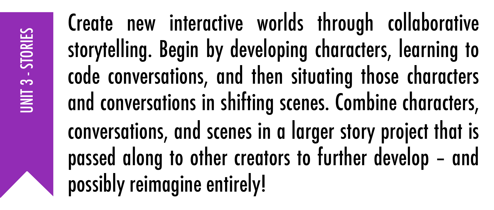

# Creative Computing Curriclum

## Coding in Stage 3: Coding & STEAM

### Mr Daniel Hickmott & Mr Andrew Lyell

#### Week 3: Coding and the Creative Arts Part 1

##### 1st June 2018

---

# Creative Computing Curriculum Guide

- A guide for teaching Coding with Scratch (inside and outside of K-12)
- Includes activities, project templates and Debug It! projects
- Encourages learners to be creators and designers with digital technologies, rather than "consumers"
- Emphasises creativity and the creation of personally meaningful projects

---

# Creative Computing Curriculum Guide

- Developed by a team of researchers from the Harvard Graduate School of Education
- Influenced by work done by Karen Brennan, [whose thesis explored balancing structure and agency of learners in Scratch](https://scholar.harvard.edu/kbrennan/publications/best-both-worlds-issues-structure-and-agency-computational-creation-and-out)
- Free and available for download (PDF and PowerPoint)    
    - Under Links heading: [ScratchEd’s Creative Computing Curriculum Guide](http://scratched.gse.harvard.edu/guide/)

---

---

# The 7 Units

- Each Unit has a theme (e.g. Unit 2 is focused on Animations)
- Each Unit usually has a *Big Idea*, 6 activities within it and a *Debug-It Studio*
- The focus of the Guide is on a "process-oriented" approach to assessment - through Projects, journals and discussion
- Each *Unit* will be linked to outcomes from a *KLA*

--- 

# Unit 0 - Getting Started

---

# Unit 1 - Exploring Scratch

---

# Unit 2 - Animations: links to the Creative Arts

---

# Unit 3 - Stories: links to English

---

# Unit 4 - Games: links to Mathematics

--- 

# Unit 5 - Diving Deeper: links to Science & Technology

---

# Unit 6 - Hackathon: links to Science & Technology

---

# Coding & STEAM and the Guide

- We will start working from Unit 2 in this program
- The Guide was written before *Teacher Accounts* were created 
- Unit 0 also introduces *Design Journals* and *Critique Groups*
- Unit 1 is called *Exploring* and the *Big Idea* behind that Unit is important

---

# Unit 1’s Big Idea

*"...educators sometimes worry that they don’t “know” enough about Scratch to be able to help others. We encourage you to take a broad view of what it means to 'know' Scratch. You don’t need to know everything about the Scratch interface or how to solve every problem that a learner encounters. But, ...educators can serve as cognitive guides, asking questions and helping break down problems into manageable pieces."*
