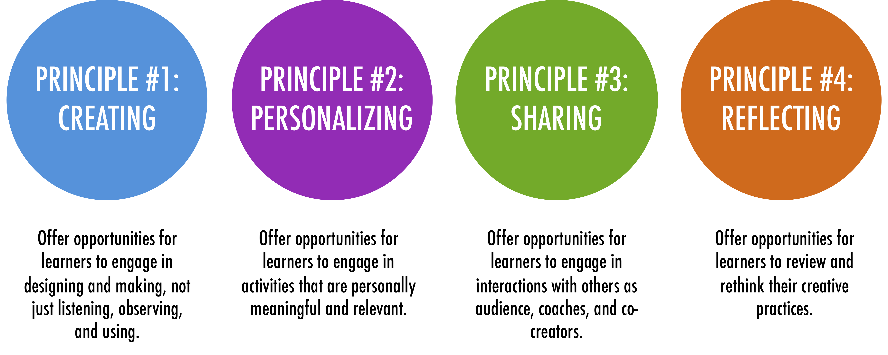

footer: [Coding & STEAM 2019 Program](https://cs4s.github.io/steam-2019/)

# Recap of Last Session

## Coding & STEAM 2019

### Dr Elena Prieto-Rodriguez & Mr Daniel Hickmott

#### Week 4: Coding and the Creative Arts Part 2

##### 22nd August 2019

---

# Last Session

- Introduced you to the Creative Computing Curriculum Guide
- A free guide for teaching Coding with Scratch (inside and outside of K-12)
- Includes activities, project templates and Debug It! projects
- Emphasises creativity and the creation of personally meaningful projects

---

---

# Teacher Accounts + Remixing

- The original Creative Computing materials were written before *Teacher Accounts* were made available
- We will use *Remixing* for the Debug It! activities today
- I will demonstrate how you can set up your own *Class Studios*
- I will also demonstrate how *Class Studios* can be used to share projects as well

---

# Unit 1's Big Idea

*"...educators sometimes worry that they don’t 'know' enough about Scratch to be able to help others. We encourage you to take a broad view of what it means to 'know' Scratch. You don’t need to know everything about the Scratch interface or how to solve every problem that a learner encounters. But, ...educators can serve as cognitive guides, asking questions and helping break down problems into manageable pieces."*

---

# Unit 2: Animations

- Unit 2 is called **Animations**
- Focus is on *Creative Diversity*
- *Music:* you will compose songs
- *Visual Arts:* you will create images
- *Drama:* You will write scripts for characters (Sprites) to act out

---

# Unit 2: Animations Part 1

- Three activities from the Guide:
    - *Performing Scripts*
    - *Build-a-Band*
    - *Orange Square, Purple Circle*
- Computational Concepts: **Sequences**, **Loops**, **Events** and **Parallelism**
