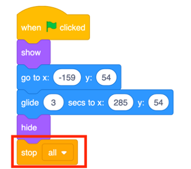

footer: [Coding & STEAM 2019 Program](https://cs4s.github.io/steam-2019/)

# Session Wrap-up

## Coding & STEAM 2019

### Dr Elena Prieto-Rodriguez & Mr Daniel Hickmott

#### Week 4: Coding and the Creative Arts Part 2

##### 22nd August 2019

---

# Creative Arts Part 2:

- Three more activities from Unit 2 of the Guide:
    - *It's Alive!*
    - *Debug It!*
    - *Music Video*
- Computational Concepts: *Sequences*, *Loops*, *Events* and *Parallelism*

--- 

# Creative Computing: Unit 2

- Unit 2 is called **Animations**
- Focus is on *Creative Diversity*
- *Music:* you will compose songs
- *Visual Arts:* you will create images
- *Drama:* You will write scripts for characters (Sprites) to act out

---

# Homework Tasks

- Every week we will ask you to complete Homework
- Contributes towards your NESA accreditation hours (each week is 2 hour, for a total of 16 hours)
- After you have finished, please email me and let me know, so I can record this
- The tasks and links to complete this homework will always be available on the session page, under the *Homework* heading 	

---

# Week 4: Recreate this Animation

- [Homework Scene](http://hckmd.com/animate)
    - Available to view and download from *Homework > Homework Scene Video* on Week 4 page as well
- Steps to complete the task are also in the *Week 4 Homework Tasks* document on Week 4 page

---

# Week 4: 6 Steps

1. Create a Project Titled "Homework Scene"
2. Change the Backdrop and Delete the Cat
3. Add the Characters and Animate Them
4. Make the Hippo Fly Across the Screen
5. Stop the Animations at the End of the Scene
6. Add a Collision to the Scene

---

# 1. Create a Project Titled "Homework Scene"

---

# 2. Change the Backdrop & Delete the Cat

---

# 3. Add the Characters and Animate Them

---

# 4. Make the Hippo Fly Across the Screen

---

# 5. Stop the Animations at the End of the Scene

---

# 6. Add a Collision to the Scene 

---

# Next Week: Coding and English Part 1

- We will start on the next Unit of the Creative Computing Curriculum guide: *Stories*
- You will learn about *Digital Storytelling* in Scratch
- The Big Idea is focused on *Reusing* and *Remixing*
- Some new Scratch blocks: *broadcasting* and *define* blocks

---

# Feedback

- If you would like to give us any feedback (e.g.: concepts you found tricky or pace of session) please complete the feedback form
- Responses can be anonymous
- Link to *Feedback Form* is on session page, under *Links* heading
- Or go to [hckmd.com/steam-feedback](http://hckmd.com/steam-feedback)