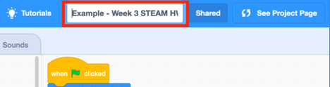
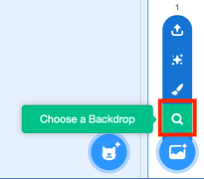

# Session Wrap-up

## Coding in Stage 3: Coding & STEAM

### Mr Daniel Hickmott & Mr Andrew Lyell

#### Week 4: Coding and the Creative Arts Part 2

##### 8th June 2018

---

# Creative Arts Part 1:

- Three more activities from Unit 2 of the Guide:
    - *It's Alive!*
    - *Debug It!*
    - *Music Video*
- Computational Concepts: *Sequences*, *Loops*, *Events* and *Parallelism*

--- 

# Creative Computing: Unit 2

- Unit 2 is called **Animations**
- Focus is on *Creative Diversity*
- *Music:* you will compose songs
- *Visual Arts:* you will create images
- *Drama:* You will write scripts for characters (Sprites) to act out

---

# Homework Tasks

- Every week we will ask you to complete Homework
- Contributes towards your NESA accreditation hours (each week is 1 hour, for a total of 10 hours)
- After you have finished, please email me and let me know, so I can record this
- The tasks and links to complete this homework will always be available on the session page, under the *Homework* heading 	

---

# Week 4: Recreate this Animation

- [Homework Scene](https://drive.google.com/uc?export=view&id=1-gXvbjtRwqzDLAAw2Jh4rt6YndunpyA6)
    - Available to view and download from *Homework > Homework Scene Video* on Week 4 page as well
- Steps to complete the task are also in the *Week 4 Homework Tasks* document on Week 4 page

---

# Week 4: 6 Steps

1. Create a Project Titled "Homework Scene"
2. Change the Backdrop and Delete the Cat
3. Add the Characters and Animate Them
4. Make the Hippo Fly Across the Screen
5. Stop the Animations at the End of the Scene
6. Add a Collision to the Scene

---

# 1. Create a Project Titled "Homework Scene"

---

# 2. Change the Backdrop & Delete the Cat

---

# 3. Add the Characters and Animate Them

---

# 4. Make the Hippo Fly Across the Screen

---

# 5. Stop the Animations at the End of the Scene

---

# 6. Add a Collision to the Scene 

---

# Next Week: Coding and English Part 1

- We will start on the next Unit of the Creative Computing Curriculum guide: *Stories*
- You will learn about *Digital Storytelling* in Scratch
- The Big Idea is focused on *Reusing* and *Remixing*
- Some new Scratch blocks: *broadcasting* and *define* blocks

---

# Journal

- Please complete a Journal entry before you leave today (should take 5-10 minutes)
- Link to Weekly Journal survey is on the session page, under the *Links* heading
- Or go to [hckmd.com/journal](hckmd.com/journal)
- **Before you leave: please Logoff and return Nametag**