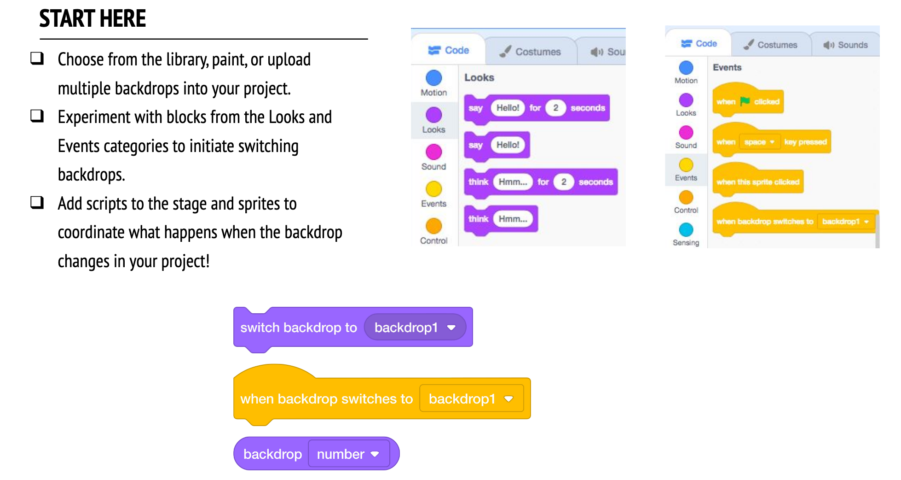

footer: [Coding & STEAM 2019 Program](https://cs4s.github.io/steam-2019/)

# Coding and English Part 1

## Coding & STEAM 2019

### Mr Daniel Hickmott & Dr Elena Prieto-Rodriguez

#### Week 5: Coding and English Part 1

##### 29th August 2019

---

# Coding and English

- What are some ways that you could use Coding to teach English?
- Does anyone use Coding for teaching English/Literacy already?
- We will look at one approach for teaching Coding alongside Literacy today: *Digital Storytelling*
- Other examples include [Adlib Stories](https://scratch.mit.edu/projects/31589574/) and [Chatbots](https://codeclubprojects.org/en-GB/scratch/chatbot/)

---

# Digital Storytelling

- The use of computers to create and share stories
- Could use a variety of software (e.g. Powerpoint and iMovie)
- *Multimodal Texts:* combining images, audio, text and video
- Scratch can do all of that - and you can learn Coding at the same time as making these texts!

---

# Digital Storytelling with Scratch

- Scratch (and other Coding tools) have been used to create digital stories
- Some resources and related research about Coding and Literacy are on the Week 5 session page 
- Can create different Characters (*Sprites*) and create interactions between them
- Can have multiple Scenes by changing Backdrops and hiding/showing *Sprites*

---

# Creative Computing: Unit 3

- Unit 3 is called **Stories**
- Focus is on "cultivating a culture that supports reusing and remixing" (from the Unit's introduction)
- Activities could be used to address *Literacy* elements in ACARA's General Capabilities
- Could also address outcomes from Stage 3 English syllabus: *Objective A* and *Objective B*

---

# Creative Computing: Unit 3

- There are a lot of examples of interactive stories in Scratch, e.g. [History: Who is Arthur Phillip?](https://scratch.mit.edu/projects/113932908/)
- Also, Unit's activities will include learning about:
    - **Computational Concepts**: *Sequences*, *Events* and *Parallelism*
    - **Computational Practices**: *experimenting and iterating*, *testing and debugging*, *reusing and remixing*

---

# English Part 1:

- Three activities from the Guide:
    - *Conversations*
    - *Characters*
    - *Scenes*
- Computational Concepts: *Sequences*, *Events* and *Parallelism*

--- 

# Conversations

- We will start with the *Conversations* activity from the Stories unit of the Guide (Unit 3)
- We will come back to the *Characters* activity later in the session
- This activity involves using *broadcast* blocks
- *broadcasting* allows *Sprites* to send messages to other *Sprites*

---

# Conversations: Broadcasting

- Unplugged activity
- Let's pretend that we are all *Sprites*
- I will *broadcast* a message
- Some of you will *receive* this message and reply to it

---

# Conversations: Penguin Jokes

- I have created a *Class Studio* named **STEAM 2019 Penguin Jokes**
- You should *remix* the *Penguin Jokes* project I added to that studio
- How can you change the project to use *broadcast* blocks instead of *wait* blocks?

---

# Conversations: Reflection Prompts

- How would you describe broadcast to someone else?
- When would you use timing in a project? When would you use broadcasting? 

---

# Characters: Custom Blocks

- In Scratch, we can *define* our own blocks
- We call these *Custom Blocks* and they are in the **More Blocks** section
- Our aim is to create a *jump* block
- Then change our project to make our Sprite (Pico) jump at different heights

---

# Characters: Jumps
    
- I will demonstrate this activity
- You can also remix the *Characters Starter Project* in the *Class Studio* named **STEAM 2019 Characters**
- We will change the project so that this happens:
    - *S* makes Pico do a small jump
    - *B* makes Pico do a big jump
    - *A* makes Pico do a jump for any height 

---

# Characters: Discussion Points

- What are *custom blocks* useful for?
- Where and when might you use them?
- Can you use the same custom block from different Sprites?

---

# Scenes

- The last activity today is called *Scenes*
- Involves changing *Stage* backdrops to change the scene to different locations

---

# Scenes

- Start by remixing the *Scenes Starter Project* in the *Class Studio* named **STEAM 2019 Scenes** 
- Feel free to change the characters and dialogue in this project to a different story
- Add some new *Scenes* to the project - try different backdrops
- I will demonstrate how to download and upload your own backdrops as well

---

# Scenes: Discussion Points

- What does the *Stage* have in common with *Sprites*? 
- How is the *Stage* different from *Sprites*? 
- How do you initiate a *Sprite's* actions in a *Scene*?  
- What other types of *Projects* (beyond animations) use *Scene* changes? 

