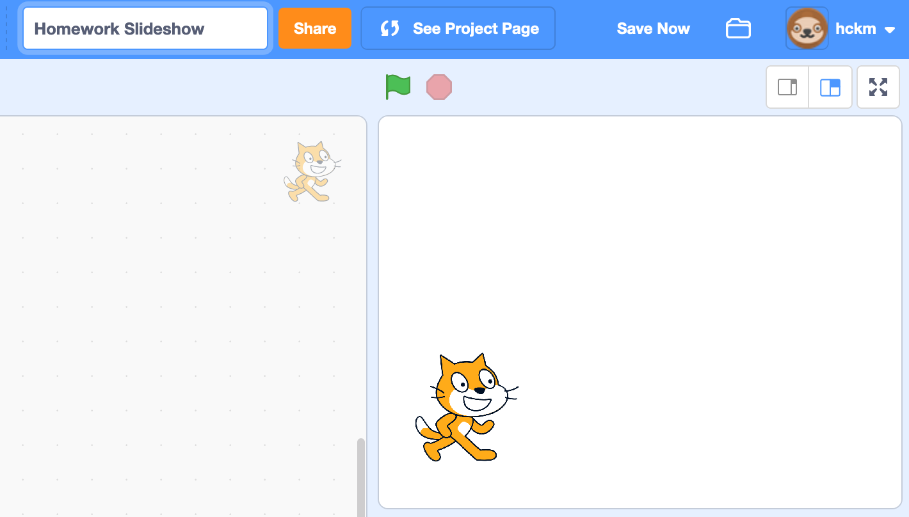
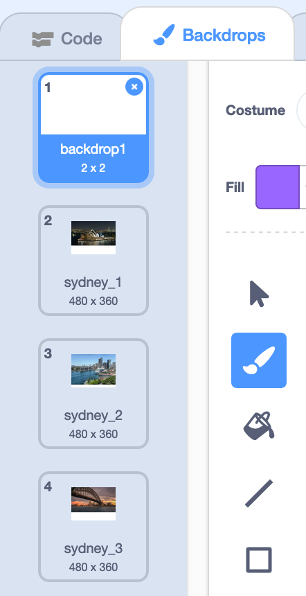
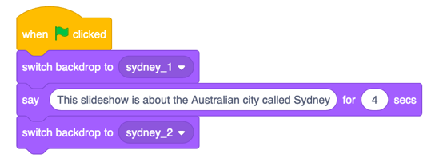
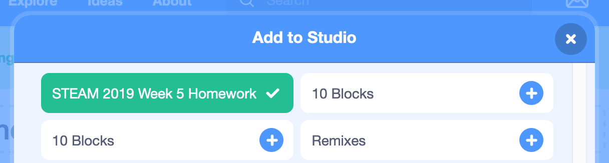

# Session Wrap-up

## Coding in Stage 3: Coding & STEAM

### Mr Daniel Hickmott & Mr Andrew Lyell

#### Week 5: Coding and English Part 1

##### 15th June 2018

---

# Recap: Unit 3 - Stories

- We started the third Unit: **Stories**
- **Computational Concepts:** *Sequences*, *Loops*, *Events* and *Parallelism*
- Focus is on the use of Scratch for *Digital Storytelling*
- Activities be linked to outcomes in *English* and *Literacy*
- We will continue with activities from this Unit next week

---

# English Part 1:

- Three activities from the Guide:
    - *Conversations*
    - *Characters*
    - *Scenes*
- Computational Concepts: *Sequences*, *Events* and *Parallelism*

---

# Homework Tasks

- Every week we will ask you to complete Homework
- Contributes towards your NESA accreditation hours (each week is 1 hour, for a total of 10 hours)
- After you have finished, please email me and let me know, so I can record this
- The tasks and links to complete this homework will always be available on the session page, under the *Homework* heading 	

---

# Week 5 Task: Create a Slideshow

- Choose any topic you like (e.g. a historical figure, a city or book series)
- Create a Slideshow in Scratch about that topic
- [Example Slideshow about Sydney](https://drive.google.com/uc?export=view&id=1zwYWEfou95J06kUM6y8aZdq6lmUWdt_e)
	- On Week 5 webpage: *Homework Slideshow Video* link

---

# Slideshow Steps

1. Create Project and Move Sprite to Bottom-Left
2. Find some Slides (Backdrops) for the Slideshow
3. Upload the Backdrops and Delete "backdrop1"
4. Add Blocks that Switch Between Slides
5. Share the Project and Add to the Studio
 
---

# Create Project and Move Sprite to Bottom-Left

---

# Find Slides for the Slideshow

---

# Upload the Backdrops and Delete "backdrop1"

---

# Add Blocks that Switch Between Slides

---

# Share the Project and Add to the Studio

---

# Next Week: Coding and English Part 2

- We will continue with the *Stories* Unit
- Activities:
	- *Debug It!*
	- *Creature Construction*
	- *Pass It On*

---

# Journal

- Please complete a Journal entry before you leave today (should take 5-10 minutes)
- Link to Weekly Journal survey is on the session page, under the *Links* heading
- Or go to [hckmd.com/journal](hckmd.com/journal)
- **Before you leave: please Logoff and return Nametag**
