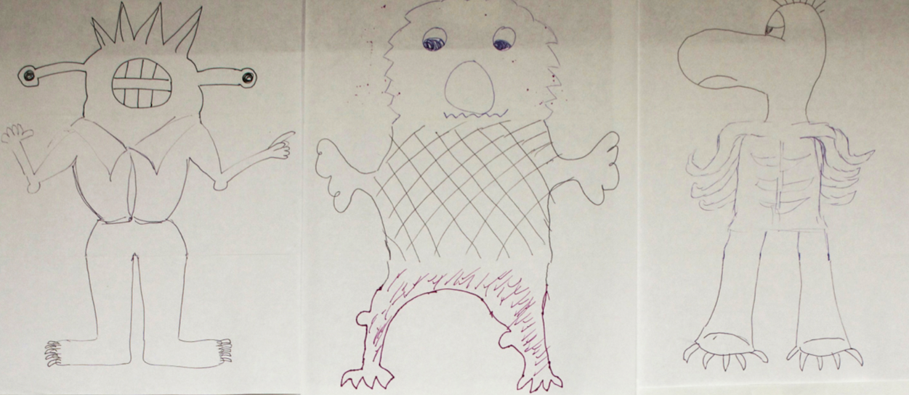
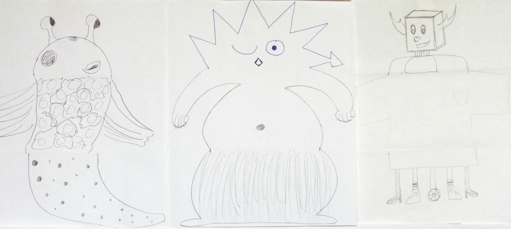
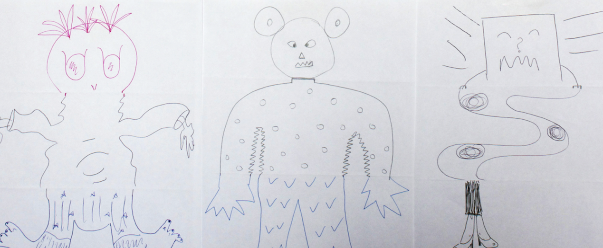

# Coding and English 2

## Coding in Stage 3: Coding & STEAM

### Mr Daniel Hickmott & Mr Andrew Lyell

#### Week 6: Coding and English Part 2

##### 22nd June 2018

---

# Creative Computing: Unit 3

- Unit 3 is called **Stories**
- Focus is on *Reusing* and *Remixing*
- *English:* you will compose digital stories as multimodal texts
- *Multimodal Texts:* combining audio, images and text

---

# Creative Arts Part 2:

- Three more activities from Unit 3 of the Guide:
    - *Debug It!*
    - *Creature Construction*
    - *Pass It On*
- **Computational Concepts:** *Sequences*, *Events* and *Parallelism*

--- 

# Unit 3: Debug It!

- Each Unit of the Creative Computing Curriculum Guide has a Studio of Debug It! activities
- I have set up *Class Studios* for each the Unit 3 Debug It activities for you to *Remix*
- *Class Studios*: **STEAM DebugIt - 3.1**, **3.2**, **3.3**, **3.4**, **3.5**
- There are a few different ways to solve these, I will show you some example solutions soon
- Once you solve the activity, you can *share* it and add it back to the *Studio*

---

# Unit 3: Debug It! Solutions

- I will show you some solutions to the Unit 3 Debug It! activities
- These won't be the only way to solve them
- You may have done something different - that is OK
- If you finish early, have a go at the [Extension: Code Club’s Chatbot Project](https://codeclubprojects.org/en-GB/scratch/chatbot/) activity

---

# Creature Construction

- An 'unplugged' activity that I will explain briefly
- Take a piece of paper and fold it in thirds
- Draw a head then pass it to the next person (with the other thirds hidden)
- Next person hands this to another person for the body (and again for the legs)
- Gets students to collaborate & create interesting results

---

# Creature Construction: Examples

---

# Creature Construction: Examples

---

# Creature Construction: Examples

---

# Pass It On!

- *Pass It On!* is an activity that is similar to *Creature Construction*
- Instead of drawing creatures, you will collaborate on Scratch projects
- Spend 10 minutes creating a Story with any *Sprites* and *Backdrops* that you like
- After 10 minutes, you will "pass it on" by moving to the next person's seat and working on their project

---

# Passing It On

- Give your project a title, such as *Pass It On Story*
- "Pass on" your computer to the person to the left
- Move to the seat to the right of you
- Go to *File > Save as a copy* to take a copy
- Remove "copy" from the project's title and replace it with your name

---

# Working on the "Pass It On" activity

- Spend 10 minutes adding to your neighbour's Story
- Make any change you would like (add a Sprite, change the Backdrop etc)
- After 10 minutes, move to your right again
- We'll do 2 more "pass ons"

---

# Finishing Pass It On!

- Return to your seat and computer
- Watch the Story and see what scenes and characters it involves
- What changes have your neighbours made to the project?
- Have they used any blocks that you have not used before? What do they do?
- Share and add the project to the *STEAM Pass It On* Class Studio

---

# Pass It On! Discussion

- What is *remixing* and why is it useful?
- How could you use *remixing* with your students?
- Did you like the changes that others made to your Story?
- Did you learn about any new blocks or features of Scratch?

