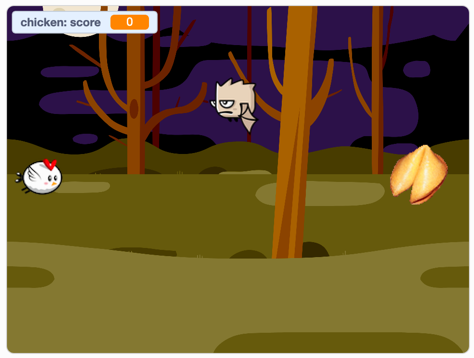
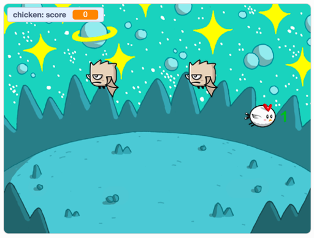

footer: [Coding & STEAM 2019 Program](https://cs4s.github.io/steam-2019/)

# Session Wrap-up

## Coding & STEAM 2019

### Mr Daniel Hickmott & Dr Elena Prieto-Rodriguez

#### Week 6: Coding and English Part 2

##### 5th September 2019

---

# Recap: Unit 3 - Stories

- We finished the third Unit: **Stories**
- **Computational Concepts:** *Sequences*, *Loops*, *Events* and *Parallelism*
- Focus was on the use of Scratch for *Digital Storytelling*
- Also demonstrates the use of *Reusing* and *Remixing*
- Activities could be linked to outcomes in *English* and *Literacy*

---

# English Part 1:

- Three activities from the Guide:
    - *Debug It!*
    - *Creature Construction*
    - *Pass It On!*
- Computational Concepts: *Sequences*, *Events* and *Parallelism*

---

# Homework Tasks

- Every week we will ask you to complete Homework
- Contributes towards your NESA accreditation hours (each week is 2 hours, for a total of 16 hours)
- After you have finished, please email me and let me know, so I can record this
- The tasks and links to complete this homework will always be available on the session page, under the *Homework* heading 	

---

# Week 6 Task: Remix and Change a Project

- Choose one of the 5 Projects that are linked under the *Projects* heading on the *Week 6 page*:
	- *Teens at the Castle*
	- *Dance Party*
	- *Hide and Seek*
	- *Wizard Spells*
	- *Cookie Bird*
	- ...or another project of your own choosing

---

# Week 6 Task: Remix and Change a Project

- Next, remix your chosen project and modify it
- Make 4 changes to the project (these can be changed in any way you like), e.g:
	- Add a *Sprite*
	- Change the *Backdrop*
- Take note of the changes you made
- Complete the form available from the [Week 6 Homework Form Link](https://forms.gle/bjfiP3rWeERMxmBE7)

---

# Week 6 Task: Remix and Change a Project

- I will show an example of a project that is a copy of the *Cookie Bird* activity
- 4 changes have been made to the project
- For the homework form, you should also identify different computational concepts in the project: *Sequences*, *Loops*, *Events* and *Parallelism*

---

# Cookie Bird Example: Original Project

- I started with the *Cookie Bird* project, which is a game with two Characters (the Chicken and the Bat)

---
# Cookie Bird Example: First Change

- Then I changed the backdrop to the "Woods" picture (from the Scratch library)

---

# Cookie Bird Example: Second Change

- Next, I changed the Cookie Sprite to look like a Fortune Cookie (from the Scratch library)

---

# Cookie Bird Example: Third Change

- Next, I duplicated the Bat Sprite and added blocks to move them to start at different spots

---

# Cookie Bird Example: Fourth Change

- Finally, I added some blocks to make the "level" change, by changing the backdrop to "Space" (from the Scratch library)

---

# Week 6 Homework Task: Completing the Form

- Once you have made your four changes to the project you remixed, you should complete the [Week 6 Homework Form Link](https://forms.gle/bjfiP3rWeERMxmBE7)
- Submitting the form will send me an email
- I will email you once I have checked the Scratch project and your response to the form
- **Make sure that you have shared the project and added it to the STEAM 2019 Week 6 Homework Class Studio**

---

# Next Week: Coding and Maths Part 1

- We will start on the next Unit of the Creative Computing Curriculum guide: *Games*
- You will learn about game design and creation in Scratch
- The Big Idea behind that Unit is the creation of projects that are personally meaningful to students
- Has links to outcomes in various KLAs - but we will focus on linking game creation to *Mathematics*

---

# Feedback

- If you would like to give us any feedback (e.g: concepts you found tricky or pace of session) please complete the feedback form
- Responses can be anonymous
- Link to *Feedback Form* is on session page, under *Links* heading
- Or go to [hckmd.com/steam-feedback](http://hckmd.com/steam-feedback)

