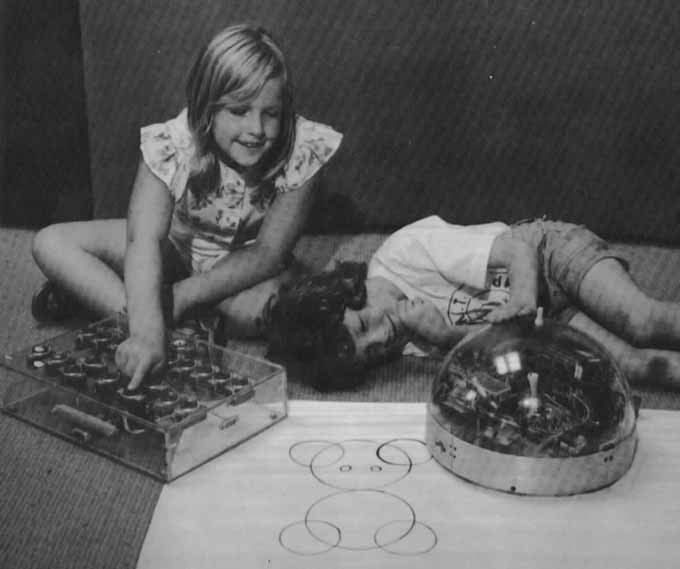

footer: [Coding & STEAM 2019 Program](https://cs4s.github.io/steam-2019/)

# Coding and Maths Part 1

## Coding & STEAM 2019

### Mr Daniel Hickmott & Dr Elena Prieto-Rodriguez

#### Week 7: Coding and Mathematics Part 1

##### 12th September 2019

---

# Coding and Maths

- *(In Coding) "...the purpose of math is not to get a good score on a test. The purpose of the math is to get your program to work. It is a self-teaching lesson."* [David Bau](http://davidbau.com/archives/2013/12/16/teaching_math_through_pencil_code.html)
- Coding and the teaching of Mathematics have been intertwined since the first educational Coding languages (for example, LOGO)
- What are some ways that you could (or do) teach Coding alongside Mathematics?

---

# Motion (Coordinates & Geometry)

---

# Scores (Formulas & Variables)

---

---

# Drawing Polygons (Formulas & Geometry)

---

# Randomness (Probability & Statistics)

---

# Game Design for Learning Maths

- In these sessions we will look at one specific way to link Mathematics and Coding: *Game Design*
- Research has been conducted on the use of game design for learning since the 1970s
- Commonly called *Constructionist Gaming*
- A recent book that summarises work in this area is called [Connected Gaming: What Making Video Games Can Teach Us about Learning and Literacy](http://www.yasminkafai.com/connected-gaming/)

---

# Making Games in Scratch

- Many tutorials available for a variety of games
- You can also remix games that others have made
- We will look at some games that do not have many Sprites or Blocks
- Scratch has *Wide walls*: we can build on the games you create today to add more features

---

# Creative Computing: Unit 4

- *"Personalization is an important guiding principle in the design of the creative computing experience. By 'personalization', we mean both connecting to personal interests and acknowledging that personal interests can vary considerably."*
- Unit 4 is called **Games** and focuses on creation of projects that are relevant to students' interests
- *"We see that kids get a much deeper understanding of the concepts they learn when they are making use of the concepts in a meaningful and motivating way."*

---

# Creative Computing: Unit 4

- The Games unit's activities can be linked to different outcomes in the Mathematics syllabus
- In particular, content from *Numbers and Algebra*: points on the Cartesian plane and calculating with percentages
- Will include learning about some new **Computational Concepts**: *Conditionals*, *Operators* and *Data*
- Build on knowledge you have of other **Computational Concepts**: *Sequences*, *Loops*, *Events* and *Parallelism*

---

# New Computational Concepts

- **Conditionals** involve having a Sprite follow different instructions based on different conditions (these commonly involve the *if then* and *if then else* blocks)
- **Operators** are all the different green blocks, which let us perform different operations (for example, adding two numbers together)
- **Data** refers to the way that we can keep track of different data, such as using a *variable* to keep track of a score 

---

# Maths Part 1:

- Three activities from the Guide:
    - **Dream Games List**
    - **Starter Games:** *Pong*, *Scrolling* and *Maze*
    - **Score**
- We will encourage you to explore and extend on the projects today: *be creative!*

--- 

# Dream Games List: Questions for Students

- Make a list of your favorite games.
- What do the games have in common?
- What features of their design make them a game?
- Create a list of design elements for your dream game.

---

# Starter Games

- There are 3 different games in the *Starter Games* activity, you can choose 1 (or more) to complete
- The Scratch team has created *Starter projects* with the Blocks, Sprites, Sounds and Backdrops already in the project
- You can use these projects with your students and ask them to build on them
- I have created remixed copies with most of the blocks removed for you to use today

---

# Starter Games: Maze

- In the [STEAM Games - Mazes](https://scratch.mit.edu/studios/5206857/) Class Studio
- The blocks that you need to add to the *Ball Sprite* and *Goal Sprite* are in the [Creative Computing Unit 4: Games Part 1](https://drive.google.com/uc?export=view&id=1ak5YtRen9SVKBt7ma6lwurf_TMNAvS2t) document 
- What do the different *when key pressed* blocks in the *Ball Sprite* do?
- Why is there a *touching color* block inside the *if* block, inside the *forever* block?

---

# Starter Games: Pong

- In the [STEAM Games - Pong](https://scratch.mit.edu/studios/5206859/) Class Studio
- The blocks that you need to add to the *Ball Sprite* and *Paddle Sprite* are in the [Creative Computing Unit 4: Games Part 1](https://drive.google.com/uc?export=view&id=1ak5YtRen9SVKBt7ma6lwurf_TMNAvS2t) document
- What do the blocks after the *when right arrow key pressed* and *when left arrow key pressed* blocks in the *Ball Sprite* do?
- What does the *if on edge, bounce* block in the *Paddle* Sprite do?

---

# Starter Games: Scrolling

- In the [STEAM Games - Scrolling](https://scratch.mit.edu/studios/5206858/) Class Studio
- The blocks that you need to add to the *Gliding bar Sprite* and *Helicopter Sprite* are in the [Creative Computing Unit 4: Games Part 1](https://drive.google.com/uc?export=view&id=1ak5YtRen9SVKBt7ma6lwurf_TMNAvS2t) document
- What is *cloning* and why is it used in the *Gliding bars Sprite*?
- Why does the *Helicopter Sprite* always fall downwards? Could you make it fall downwards slower or faster?

--- 

# Starter Games

- Choose one of the *Starter Games* and add the blocks as instructed in the Guide
- As you are adding blocks, try and predict what they will do
- You may use some blocks you haven't used before, let us know if you have any questions about them
- If you complete the activity quickly, remix another Starter game or add more features from the *Things to Try* section

---

# Starter Games: Computational Concepts?

- Sequences
- Loops
- Events
- Parallelism
- Operators
- Conditionals
- Data

---

# Score

- The next activity involves adding a *Score* to an existing project
- The project we will modify can be remixed from the [Fish Chomp Class Studio](https://scratch.mit.edu/projects/230713226/)
- In Coding, we can use *variables* to keep track of scores
- When we keep track of values (e.g. numbers or text), we call this **Data**

---

# Variables as Buckets

---

# Extensions

- In the [Creative Computing Unit 4: Games Part 1](https://drive.google.com/uc?export=view&id=1ak5YtRen9SVKBt7ma6lwurf_TMNAvS2t) document, there is also an *Extensions* activity
- That activity includes ideas for how to extend the Games that you have worked on
- Example projects are also in the materials
- If you finish the other activities quickly, have a go at adding these extensions
- You can use the *Backpack* to copy blocks to your project from the Example Extensions projects
