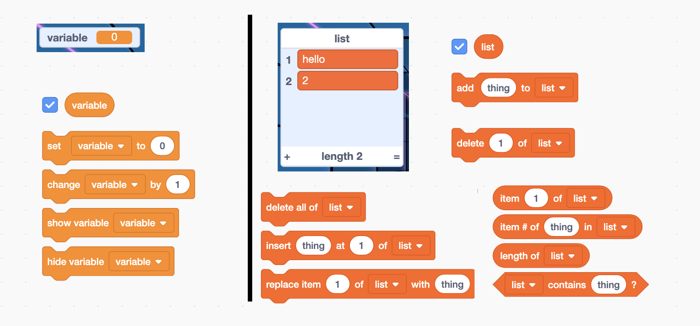

footer: [Coding & STEAM 2019 Program](https://cs4s.github.io/steam-2019/)

# Coding and Mathematics Part 2

## Coding & STEAM 2019

### Mr Daniel Hickmott & Dr Elena Prieto-Rodriguez

#### Week 8: Coding and Mathematics Part 2

##### 19th September 2019

---

# Creative Computing: Unit 4

- *"Personalization is an important guiding principle in the design of the creative computing experience. By 'personalization', we mean both connecting to personal interests and acknowledging that personal interests can vary considerably."*
- Unit 4 is called **Games** and focuses on creation of projects that are relevant to students' interests
- *"We see that kids get a much deeper understanding of the concepts they learn when they are making use of the concepts in a meaningful and motivating way."*

---

# Creative Computing: Unit 4

- The Games unit's activities can be linked to different outcomes in the Mathematics syllabus
- In particular, content from *Numbers and Algebra*: points on the Cartesian plane and calculating with percentages
- Will include learning about some new **Computational Concepts**: *Conditionals*, *Operators* and *Data*
- Build on knowledge you have of other **Computational Concepts**: *Sequences*, *Loops*, *Events* and *Parallelism*

---

# Mathematics Part 2:

- Two activities from the Guide:
    - **Debug It!**
    - **Interactions**
- The activities today are less guided to previous weeks' activities and more open-ended
- We will encourage you to explore and extend on the projects today: *be creative!*

--- 

# Debug It!

- I have created *Class Studios* for each of the *Games* Unit's *DebugIt* activities
- We have included some hints in the slides as well

---

# STEAM DebugIt 4.1

- When you move the Cat with the arrow keys, he moves around the Stage
- When the Cat collides with the other Sprites, these items should be added to the *Inventory* (a *List*)
- Hint: how do you check whether two Sprites are touching?

---

# Variables vs Lists

- What's the difference between *Variables* and *Lists*?

---

# Variables vs Lists

- *Variables* can **only have 1 value**
- A *List* can contain 0 or more *Variables*

---

# STEAM DebugIt 4.2

- When the Cat touches a yellow Gobo Sprite, the *score variable* increases by 10
- We want the score to decrease by 10 whenever the Cat runs into a pink Gobo Sprite
- Hint: how could you use a *change by* block (in the *Data* category) to decrease a *variable*?

---

# STEAM DebugIt 4.3

- A project where a random number is chosen as a "secret number"
- You then try and guess the secret number
- The Cat is supposed to tell you when your guess is too low or too high, but this doesn't really work
- How can we make the hints that the Cat gives more helpful to the person guessing the secret number?
- Hint: how do the different comparison (*<*, *=* and *>*) blocks from the *Operators* category work?

---

# STEAM DebugIt 4.4

- When one of the tennis balls hits the Scratch Cat, the *# of hits* variable should increase by 1
- Sometimes the *# of hits* variables goes up by a lot more than 1 when the ball hits the Cat
- How can we change the blocks so that the *# of hits* variable only increases by 1 each time a ball hits the Scratch Cat?
- Hint: how often do you think a Sprite follows an *if* block when it's in a *forever* block?

---

# STEAM DebugIt 4.5

- This project is a Maze game, similar to the Starter Project we looked at last week
- When the Cat runs into the yellow rectangle (the goal) he says: "You win!"
- But... the Cat can walk through the walls! How can you change the project to make it so that the Cat can't walk through walls?

---

# Interactions (Puzzles)

- The next activity is a bit different to the activities in other sessions
- Involves creating your own projects from "scratch" (:grin:) that solve different *Puzzles*
- You may have to learn about some blocks that we have not explored in other weeks' activities
- Feel free to be creative and personalise the projects as you would like, there are multiple ways to solve the *Puzzles*

---

# Puzzles #1, #2, #3

1. Whenever you press the B key, the sprite gets a little bigger. Whenever you press the S key, the sprite gets a little smaller.
2. Whenever the sprite hears a loud sound, it changes color.
3. Whenever the sprite is in the top 25% of the screen, it says "I like it up here."  

---

# Puzzle #1 Hints

- What *Event* block can you use to trigger actions when a key is pressed?
- Have you tried using the *change size by* block from the *Looks* category before?

---

# Puzzle #2 Hints

- What does the *loudness* block in the *Sensing* section report when you click on it?
- What happens when you click the checkbox next to a block like *loudness* in the *Sensing* section?
- What blocks can you use to check whether a value is *greater than* a certain amount?

---

# Puzzle #3 Hints

- The Stage in Scratch is 360 pixels high.
- The points in the vertical middle of the Stage will have a *y position* of 0
- The highest point will have a *y position* of 180
- When a Sprite is in the top 25% of the Stage, what will the range of possible *y positions* be?
- How can you check whether a Sprite's *y position* is greater than a certain amount?

---

# Puzzle #7, #8, #9

7. Whenever you click on the background, a flower appears at that spot. 
8. Whenever you click on a sprite, all other sprites do a dance.
9. Whenever you move the mouse-pointer, the sprite follows but doesn't touch the mouse-pointer.

---

# Puzzle #7 Hints

- What does the *mouse down?* block in the *Sensing* section do?
- What block makes the Sprite *go to* the mouse cursor?
- Have you used the *stamp* block from the *pen* section before? What does it do?
- How can you sequence the *hiding* and *showing* of a Sprite to make it only appear when the background is clicked on?

---

# Puzzle #8 Hints

- How can you use blocks from the *Control* and *Motion* sections to make a Sprite dance?
- Do you remember how to send messages to other Sprites and have other Sprites respond to that message? 
- The blocks that allow you to send and receive messages are in the *Events* section

---

# Puzzle #9 Hints

- What happens when you make a Sprite *go to* a certain point in a forever block?
- How can you get the position of the mouse? (*mouse x* and *mouse y*)
- Which operations could you use to calculate *x* and *y* positions close to the mouse's position?

---

# Interactions Discussion

- How did you find the *Interactions* activity?
- Could you see any links to Mathematics (or other sujects) when solving the *Puzzles*?
- Did you personalise the projects you made at all?
- You may have noticed *Puzzles #4*, *#5* and *#6* were missing
- Those puzzles are part of the homework task and are in the [Week 8 Homework Interactions Puzzles document](https://cs4s.github.io/steam-2019/week-8/activities/creative_computing_unit_4_games_part_2.pdf)

