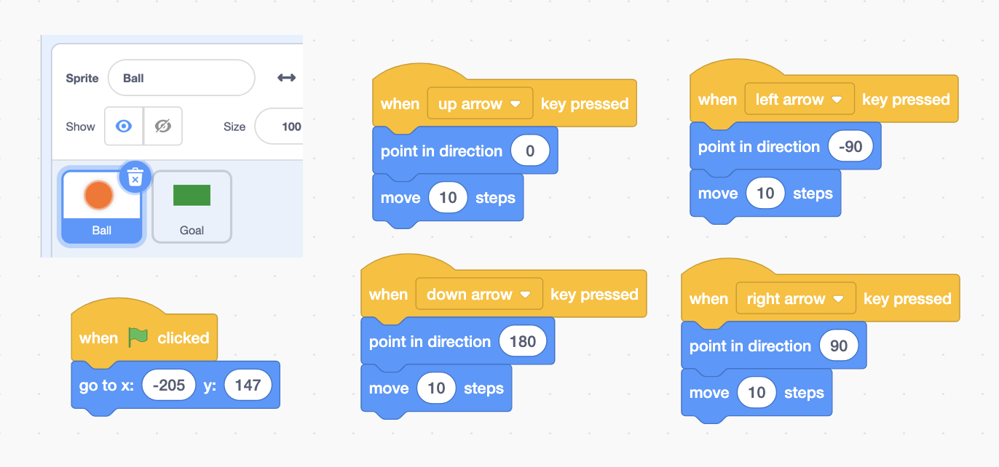

footer: [Coding & STEAM 2019 Program](https://cs4s.github.io/steam-2019/)

# End of Program and Recap

## Coding & STEAM 2019

### Mr Daniel Hickmott & Dr Elena Prieto-Rodriguez

#### Week 8: Coding and Mathematics Part 2

##### 19th September 2019

---

# End of Program :disappointed:

- This is the last week of the *Coding & STEAM* program
- Before we start today, I am going to go over a few things about the research part of the program
- Like Week 1, we will ask you to complete a survey
- After this presentation and the survey, we will continue with some activities
- I can stay around for 30-60 mins at the end

---

# Research

- This Professional Learning (PL) program is part of a research project
- The purpose is to help understand how teachers can be supported in learning and teaching Coding and Computational Thinking
- We hope this research helps other PL providers implement PL that is useful and relevant to teachers
- Please take 10-15 minutes to complete the [End of Program Survey](https://www.surveymonkey.com/r/C_S2019-post) linked to on the session page

---

# Homework & Accreditation

- If you have completed all of the tasks and attended/caught up all of the sessions, I will ask the office staff to process your accreditation hours asap
- I would like to finalise the hours and accreditation by the end of the school holidays (October 11th)
- We will send out certificates around October 11th as well, please let me know if you need the certificate before then

---

# Coding and Mathematics

- Last week we started the *Games* unit of the Creative Computing Guide
- Also looked at some ways that *Game Design* can be linked to the teaching of Mathematics
- Coding, the design of games and the teaching of Mathematics have been intertwined since the first educational Coding languages (for example, LOGO)
- What *mathematical concepts* and *computational concepts* were in the Week 7 activities?

---

# Motion (Coordinates & Geometry)

---

# Motion (Coordinates & Geometry): Maze

---

# Scores (Formulas & Variables)

---

# Scores (Formulas & Variables): Fish Chomp

---

# Randomness (Probability & Statistics)

---

# Randomness (Probability & Statistics)

---

# Computational Concepts

- The activities last week involved using some different **Computational Concepts**, such as:
    - *Parallelism*
    - *Conditionals*
    - *Operators*
    - *Data*

---

# Computational Concept: Parallelism (Fish Chomp)

---

# Computational Concept: Conditionals (Scrolling)

---

# Computational Concept: Operators (Scrolling)

---

# Computational Concept: Data

