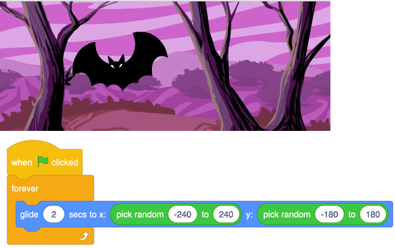
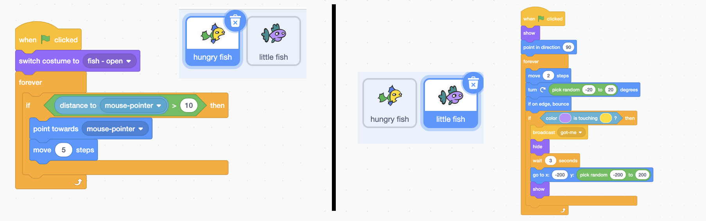
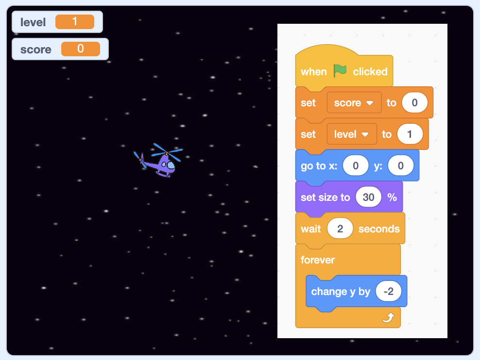

footer: [Coding & STEAM 2019 Program](https://cs4s.github.io/steam-2019/)

# Recap of Last Session

# Coding and Mathematics Part 1

## Coding & STEAM 2019

### Mr Daniel Hickmott & Dr Elena Prieto-Rodriguez

#### Week 8: Coding and Mathematics Part 2

##### 19th September 2019

---

# Coding and Mathematics

- Last week we started the *Games* unit of the Creative Computing Guide
- Also looked at some ways that *Game Design* can be linked to the teaching of Mathematics
- Coding, the design of games and the teaching of Mathematics have been intertwined since the first educational Coding languages (for example, LOGO)
- What *mathematical concepts* and *computational concepts* were in the Week 7 activities?

---

# Motion (Coordinates & Geometry)

---

# Motion (Coordinates & Geometry): Maze

---

# Scores (Formulas & Variables)

---

# Scores (Formulas & Variables): Fish Chomp

---

# Randomness (Probability & Statistics)

---

# Randomness (Probability & Statistics)

---

# Computational Concepts

- The activities last week involved using some different **Computational Concepts**, such as:
    - *Parallelism*
    - *Conditionals*
    - *Operators*
    - *Data*

---

# Computational Concept: Parallelism (Fish Chomp)

---

# Computational Concept: Conditionals (Scrolling)

---

# Computational Concept: Operators (Scrolling)

---

# Computational Concept: Data

---

# Computational Concept: Data

---

# Computational Concept: Data

